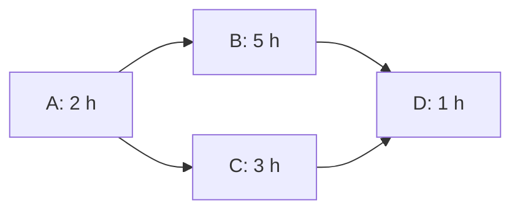

# Sesiones 8 y 9 — Plan del próximo incremento

- **Proyecto:** Sistema de inscripciones a talleres.
- **Integrantes:** Ismael Diaz, Marcos Dominguez y Katrina Leigue.
- **Fecha:** 6 de octubre de 2026.
- **Flujo:** Admisión en espera, cancelación y promoción automática.
- **Estado:** Propuesto; disponibilidad y aclaraciones pendientes de confirmar.

## 1. Fuentes y punto de partida

- [Sesión 6: requisitos](sesion_06_requisitos.md).
- [Sesión 7: modelos](sesion_07_modelos.md).
- **Versión revisada:** `38249666e65fb4c3eb2df47b4628d62c69c9d2fd`, rama `main`.

| ID | Relación con el incremento |
|---|---|
| TAL-RF-01 | Promoción automática sin superar el cupo. |
| TAL-RF-03 | Límite de espera del 20 % en casos de porcentaje entero. |
| TAL-HU-01 | Solicitud de plaza y consulta del estado. |
| TAL-CU-01 | Admisión en espera, liberación de plaza y promoción. |
| TAL-MOD-01 | Actividad y estados de inscripción. |
| TAL-RT-01 | Inicio del taller y anticipación de la cancelación. |

**Existente:** registro de talleres y participantes, inscripciones confirmadas, rechazo de duplicados y cupo agotado, menú de terminal y 19 funciones de prueba.

**Pendiente:** espera, cancelación, promoción, consulta del antecedente cancelado y hora de inicio. Las pruebas existentes no demuestran estas funciones; su nueva ejecución está pendiente.

## 2. Alcance

### Incluye

- Estados de inscripción confirmada, en espera y cancelada.
- Admisión en espera para un taller completo, respetando el límite confirmado en casos de porcentaje entero.
- Orden por fecha y hora de solicitud, con marcas distintas en esta demostración.
- Cancelación de una inscripción confirmada antes del inicio, usando ejemplos con más de tres horas de anticipación.
- Promoción automática de una sola persona por la plaza liberada; conservación del orden restante y del cupo.
- Antecedente cancelado visible en una consulta por participante.
- Pruebas, revisión y pasos reproducibles de demostración en terminal.

### Exclusiones temporales

Los demás comportamientos de los requisitos y modelos previos quedan fuera de este incremento, sin eliminar obligaciones del proyecto.

### Dependencias y supuestos

- Se reutilizan participantes, talleres y registros existentes.
- A define el contrato de funciones, datos y resultados antes de B y C.
- Los ejemplos usan porcentajes enteros y solicitudes sin empates.
- B incorpora la hora de inicio y la comprobación del momento de cancelación.
- La demostración es local; el antecedente se consulta durante la misma ejecución.
- El calendario usa horas continuas desde `t = 0`; la disponibilidad debe confirmarse.

### Casos de comprobación

| Caso | Datos y acción | Resultado esperado |
|---|---|---|
| Admisión | Cupo 10, con 10 confirmados; C y luego D solicitan entrar en espera con horas distintas. | C y D quedan en espera, en ese orden; límite de dos personas. |
| Cancelación y promoción | Una persona confirmada del taller anterior cancela cinco horas antes del inicio. | Su inscripción queda cancelada; C pasa a confirmada, D permanece en espera y se mantienen 10 confirmados. El antecedente es consultable. |
| Límite | Cupo 20, con 20 confirmados y tres en espera; una cuarta persona solicita entrar. | Se admite a la cuarta persona y se alcanza el límite de cuatro en espera. |

El caso de límite reutiliza la restricción de capacidad de la sesión 6.

## 3. Tareas y estimaciones

| Tarea | Trabajo | Esfuerzo | Duración | Predecesoras | Responsable | Evidencia de terminación |
|---|---|---:|---:|---|---|---|
| A | Revisar fuentes, aclarar dudas y acordar contrato y casos. | 2 h-p | 2 h | Ninguna | Ismael | Contrato y casos revisados; dudas indispensables resueltas o bloqueo registrado. |
| B | Implementar espera, hora de inicio, cancelación, promoción y consulta del antecedente; adaptar el menú. | 5 h-p | 5 h | A | Marcos | Código en una rama y recorrido manual de los casos incluidos. |
| C | Preparar pruebas de admisión, límite, anticipación, orden, cupo y antecedente cancelado. | 3 h-p | 3 h | A | Katrina | Pruebas escritas según el contrato de A y los requisitos relacionados. |
| D | Integrar, ejecutar pruebas nuevas y de regresión, revisar y documentar la demostración. | 3 h-p | 1 h | B y C | Los tres | Versión identificada, resultados guardados e instrucciones reproducibles. |

**Esfuerzo total:** 13 h-p.

### Fundamento de las estimaciones

- **A:** revisión de dos documentos y definición del contrato. Una respuesta pendiente puede ampliar la duración.
- **B:** reutilización del registro existente y desarrollo de las funciones pendientes. Cambios del contrato pueden ampliar el trabajo.
- **C:** reutilización de ejemplos con `pytest`. Aprendizaje o cambios del contrato pueden ampliar el trabajo.
- **D:** revisión conjunta de tres personas durante una hora. Defectos extensos requieren re-estimar.

B y C pueden ejecutarse en paralelo porque A define el contrato; la ejecución integrada de las pruebas corresponde a D.

## 4. Dependencias y ruta crítica

Cada flecha exige terminar la tarea anterior. Tiempos en horas desde `t = 0`, con recursos suficientes y meta inicial de 8 h.

| Tarea | Duración | IT | FT | ITa | FTa | Holgura |
|---|---:|---:|---:|---:|---:|---:|
| A | 2 | 0 | 2 | 0 | 2 | 0 |
| B | 5 | 2 | 7 | 2 | 7 | 0 |
| C | 3 | 2 | 5 | 4 | 7 | 2 |
| D | 1 | 7 | 8 | 7 | 8 | 0 |

- **Ruta crítica:** A → B → D = 8 h.
- **Otra ruta:** A → C → D = 6 h.
- **Holgura de C:** 2 h respecto de la meta inicial.

## 5. Gantt y disponibilidad

| Tarea | 0–1 h | 1–2 h | 2–3 h | 3–4 h | 4–5 h | 5–6 h | 6–7 h | 7–8 h |
|---|---|---|---|---|---|---|---|---|
| A — Ismael | ■ | ■ | | | | | | |
| B — Marcos | | | ■ | ■ | ■ | ■ | ■ | |
| C — Katrina | | | ■ | ■ | ■ | | | |
| D — Los tres | | | | | | | | ■ |

| Persona | Disponibilidad requerida | Conocimiento necesario |
|---|---|---|
| Ismael | 0–2 h y 7–8 h | Requisitos, capacidad y casos. |
| Marcos | 2–8 h | Reglas de inscripción y menú. |
| Katrina | 2–5 h y 7–8 h | `pytest`, estados, orden, cupo y tiempos. |

B y C tienen responsables distintos; D espera a ambas. No hay doble asignación bajo la disponibilidad propuesta.

### Contingencia

Si Katrina no puede preparar C, Marcos la asume después de B, suponiendo que domina las pruebas:

| Tarea | Responsable | Inicio | Fin |
|---|---|---:|---:|
| A | Ismael | 0 | 2 |
| B | Marcos | 2 | 7 |
| C | Marcos | 7 | 10 |
| D | Los tres | 10 | 11 |

La duración pasa a 11 h. Se supone que Katrina puede asistir a D; de lo contrario, se recalcula. Las holguras iniciales no garantizan este calendario.

## 6. Riesgos

| Riesgo | Probabilidad y razón | Consecuencia | Prevención | Señal y contingencia | Responsable |
|---|---|---|---|---|---|
| Una aclaración cambia el límite de espera o los casos de cancelación. | Media: los casos requieren revisión. | Retrabajo de B y C; retraso de D. | Acordar casos y contratos en A. | Una respuesta contradice lo acordado: detener la parte afectada y re-estimar. | Ismael |
| La promoción altera el orden, supera el cupo o pierde el antecedente cancelado. | Media: son comportamientos nuevos. | D no puede cerrar. | Preparar pruebas de estados, orden, cupo y antecedente. | Una prueba falla: corregir, repetir la comprobación y revisar el calendario. | Marcos; Katrina verifica |

## 7. Entregable, hito y estado real

**Entregable:** versión local del flujo, pruebas y guía de demostración en terminal.

**Hito:** revisión de D completada sobre una misma versión: admisión dentro del límite, cancelación con más de tres horas de anticipación, promoción de una sola persona respetando orden y cupo, antecedente cancelado consultable y pruebas nuevas y de regresión aprobadas.

| Tarea | Estado | Evidencia o explicación | Horas reales |
|---|---|---|---|
| A | En curso | Fuentes revisadas y casos propuestos; contrato y confirmaciones pendientes. | No registradas |
| B | No iniciada | Sin implementación nueva del incremento. | No registradas |
| C | No iniciada | Sin pruebas nuevas del incremento. | No registradas |
| D | No iniciada | Integración, ejecución y demostración pendientes. | No registradas |

## 8. Siguiente acción y revisión

- **Siguiente acción:** Ismael resuelve las consultas necesarias y el equipo acuerda el contrato y confirma disponibilidad; Marcos prepara la rama y Katrina comprueba la ejecución de pruebas.
- **Momento:** reunión pendiente de acuerdo; revisión al cerrar A y antes de D.
- **Condiciones para revisar:** cambio de los casos, indisponibilidad, datos temporales insuficientes, B superior a 5 h o correcciones que excedan la hora prevista para D.
- **Actualización:** revisar tareas, esfuerzo y calendario, conservando las estimaciones iniciales.

