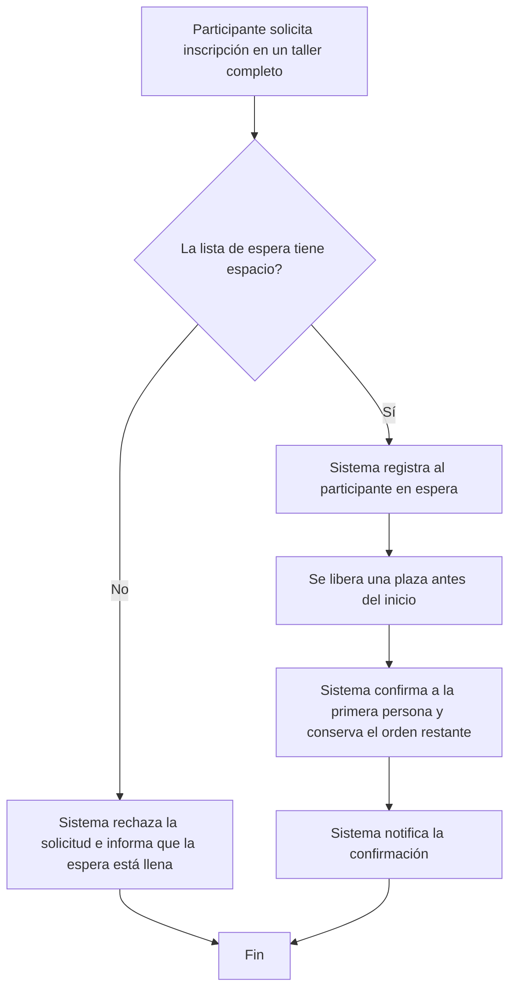

# Sesión 7 — Historias, casos de uso y modelos

- **Proyecto:** Sistema de inscripciones a talleres
- **Integrantes:** Marcos Dominguez, Katrina Leigue, Ismael Diaz
- **Fecha:** 2 de octubre de 2026
- **Requisitos de origen:** [Sesión 6](sesion_06_requisitos.md)
- **Flujo seleccionado:** Lista de espera (solicitar la inscripción en un taller sin cupos y resolver la solicitud mediante la lista)
- **IDs seleccionados y estado de aprobación:** `TAL-RF-01`, aprobado salvo el desempate de solicitudes con la misma marca de tiempo; y `TAL-RF-03`, aprobado para cupos cuyo 20 % sea entero redondeado decimales hacia abajo.

## 1. Historia TAL-HU-01

Como participante, quiero solicitar mi inscripción en un taller que no tiene cupos disponibles y conocer el resultado de la solicitud para entrar en la lista de espera, saber si esta se encuentra llena y recibir la confirmación cuando se libere una plaza que me corresponda.

- **Requisitos relacionados:** `TAL-RF-01` y `TAL-RF-03`.

## 2. Caso de uso TAL-CU-01 — Gestionar una inscripción mediante la lista de espera

- **Objetivo:** Registrar a una persona en la lista de espera de un taller completo y confirmar automáticamente cuando le corresponda una plaza liberada.
- **Actor principal:** Usuario-Participante.
- **Disparador:** El participante solicita inscribirse en un taller cuyo cupo está completo.
- **Precondiciones:** El taller existe, todavía no ha comenzado y todas sus plazas están ocupadas. La disponibilidad de espacio en la lista de espera se comprueba dentro del flujo, no es una precondición.
- **Poscondición de éxito:** La persona que ocupa la primera posición de la lista queda confirmada, deja la lista de espera, recibe una notificación y el taller no supera su cupo máximo. Las demás personas conservan su orden relativo.
- **Garantía ante rechazo:** No se crea una inscripción activa para la persona solicitante; las inscripciones confirmadas y la lista de espera conservan su cantidad, sus datos y su orden; el sistema informa que la lista de espera está llena.

### Flujo principal

1. El participante identifica el taller completo y solicita la inscripción con el colaborador.
2. El sistema comprueba el límite de la lista de espera, equivalente al 20 % del cupo máximo del taller.
3. El sistema determina que todavía hay espacio en la lista de espera.
4. El sistema registra al participante en la lista de espera.
5. Antes del inicio del taller, una persona con inscripción confirmada cancela y libera una plaza.
6. El sistema confirma automáticamente a la persona ubicada en la primera posición y la retira de la espera.
7. El sistema conserva el orden de las demás personas sin superar el cupo del taller.
8. El sistema notifica a la persona promovida que su inscripción fue confirmada.

### E1 — Rechazo porque la lista de espera está llena

- **Ocurre en el paso:** 2.
- **Condición:** La lista de espera ya alcanzó el 20 % del cupo máximo del taller.
- **Respuesta del sistema:** Rechaza la solicitud e informa que la lista de espera está llena.
- **Estado final y datos que se conservan:** La persona solicitante continúa sin una inscripción activa; no cambian las plazas confirmadas, la cantidad de personas en espera ni su orden.
- **El caso termina en:** El rechazo informado al participante.

## 3. Modelo TAL-MOD-01

- **Tipo elegido:** Diagrama de actividad simplificado.
- **Pregunta que responde:** ¿Qué sucede con la solicitud cuando el taller está lleno y cómo pasa una inscripción de espera a confirmar?
- **Alcance y aspectos que deja fuera:** Representa la admisión, el rechazo y la promoción automática. No define el canal técnico de notificación, el tratamiento de un fallo al notificar ni el redondeo del 20 % cuando el resultado no es entero, porque esos acuerdos continúan pendientes.

## 4. Estados y efectos sobre los datos

- **Entidad modelada:** Inscripción de una persona en un taller.

| Estado actual | Evento y condición | Estado siguiente | Efecto sobre los datos |
|---|---|---|---|
| Sin inscripción activa | Solicitud con taller completo y espacio en la lista de espera | En espera | Se registra la solicitud en la lista de espera. |
| Sin inscripción activa | Solicitud con taller completo y lista de espera llena | Sin inscripción activa | No se crea un registro activo ni se modifican las confirmaciones o la lista existente. |
| En espera | Se libera una plaza antes del inicio y la persona ocupa la primera posición | Confirmada | La persona sale de la espera, ocupa la plaza y es notificada; las demás posiciones avanzan sin alterar su orden relativo. |

«Sin inscripción activa» describe la ausencia de un registro activo, no necesariamente un valor almacenado. La cancelación corresponde a otra inscripción y conserva su propio antecedente; no es un estado de la inscripción promovida.

## 5. Trazabilidad

| Requisito de sesión 6 | Historia / caso de uso | Paso o rama del modelo | Escenario de aceptación relacionado |
|---|---|---|---|
| `TAL-RF-03` — Límite de la lista de espera | `TAL-HU-01`; `TAL-CU-01`, pasos 1–4 y E1 | `TAL-MOD-01`, decisión «¿La lista de espera tiene espacio?» | Rechazo: T-01 tiene cupo 20, 20 plazas ocupadas y 4 personas en espera; P-25 solicita inscribirse. La solicitud se rechaza, la espera conserva sus 4 personas en el mismo orden y el sistema informa que está llena. |
| `TAL-RF-01` — Promoción automática por orden de espera | `TAL-HU-01`; `TAL-CU-01`, pasos 5–8 | `TAL-MOD-01`, desde la liberación de la plaza hasta la notificación | Normal: T-01 tiene cupo 2; A y B están confirmados; C y D esperan en ese orden. A cancela antes del inicio; C queda confirmada y notificada, D sigue en espera y la ocupación se mantiene en 2. |

Los escenarios se recorrieron sobre el modelo; esto no equivale a ejecutar pruebas del programa.

## 6. Dudas pendientes

| Requisito | Duda o cambio | Estado / confirmación del cliente | Impacto |
|---|---|---|---|
| `TAL-RF-01` | ¿Qué canal se usa para notificar y qué ocurre si la entrega falla? | Pendiente de consulta al cliente. | Se modela la obligación de notificar, pero no el medio ni la recuperación ante fallos. |
| `TAL-RF-01` | ¿Cómo se desempatan solicitudes con la misma marca de tiempo? | Pendiente de consulta al cliente. | No puede definirse de forma definitiva quién ocupa primero la espera en ese caso límite. |

## 7. Siguiente paso y participación

- Tarea de desarrollo derivada del modelo: Lista de espera de talleres
- Requisito que la justifica:TAL-RF-01 — Promoción automática por orden de espera
TAL-RF-03 — Límite de la lista de espera
- Responsable inicial: Usuario Cliente
- Issue existente o nuevo, si corresponde: No corresponde por el momento
- Aportes de cada integrante: 
- **Ismael Diaz:** Selección de flujo e identificación de funcionalidades, formulación de dudas pendientes.
- **Marcos Dominguez:** Redacción de historias de usuario, casos de rechazo y aceptación y actualización del repositorio en GitHub..
- **Katrina Leigue:** Diagrama simplificado, tabla de estados y efectos y trazabilidad.
- Asistencia de IA, si se utilizó: ChatGPT / Gemini para estructurar el formato del Markdown según la plantilla requerida.

